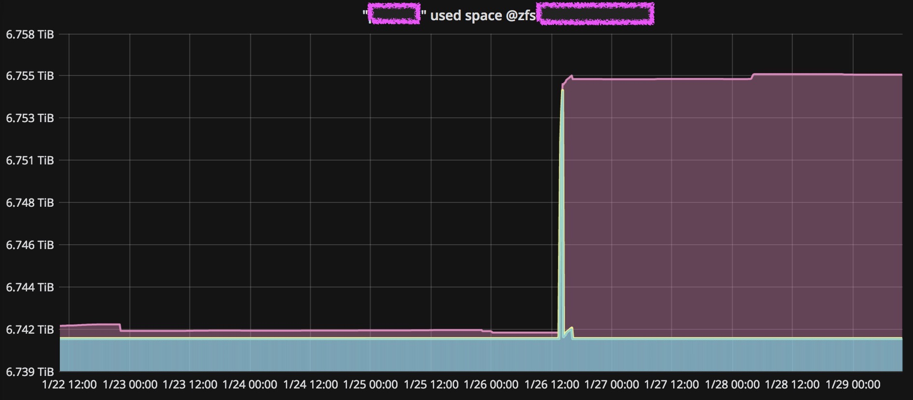

# icinga2-plugin-zfsstats
Check USED, REFER and AVAIL on ZFS dataset

This is a small check plugin I wrote for our ZFS file storages.
* **Tested on Solaris only.**
* That's why GNU tools are **hardcoded**. This may change in further releases.
* Perhaps, it will be working on Linux as well after some changes, but I never tested that - in fact, we have no ZFS on Linux at all.
* It runs in production on our servers, and it is written for them - status **worksforme** ;) As the community asked me, I provide it here, but you'll be probably not able to use it without further intervention.

### Usage
```
zfs_stats.sh [ -c <critical_space> ] [ -w <warning_space> ] -d <dataset>
```

### Example
```
$ ./zfs_stats.sh -d Data01/archives
OK: 4.08T available on Data01/archives, that's fairly enough.
Dataset information about Data01/archives:
|used=6504801769440;650480176944;325240088472;0;10995116277760 available=4490314508320;;;;10995116277760 refer=6504778126080;;;;10995116277760
```

### Screenshots
This is a sample output in Icinga Web 2.


You can process your performance data and create cool Grafana dashboards; I'm using templating, so every admin can explicitly select ZFS server and needed dataset on it.

