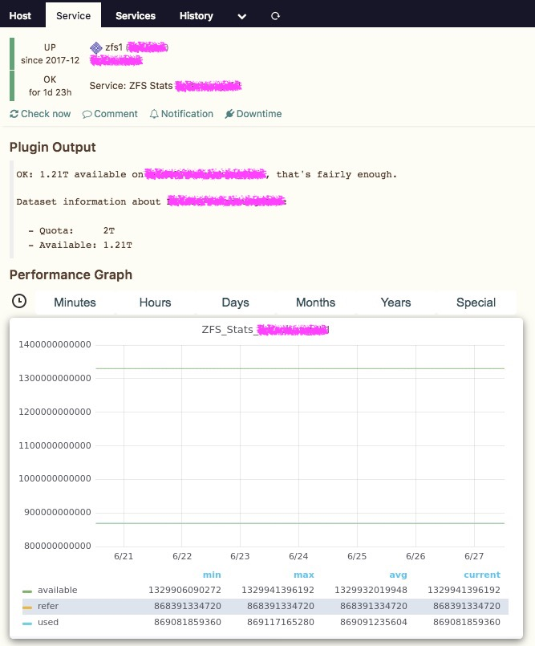

# icinga2-plugin-zfsstats
Check USED, REFER and AVAIL on ZFS dataset

This is a small check plugin I wrote for our ZFS file storages.
* **Tested on Solaris only.**
* **Tested using `zfs@0.5.11-2017.0.0.16893:20171207T010544Z`** – old `zfs` versions seem to cause problems.
* Perhaps, it will be working on Linux as well after some changes, but I never tested that - in fact, we have no ZFS on Linux at all.
* It runs in production on our servers, and it is written for them - status **worksforme** :innocent: As the community asked me, I provide it here, but you'll be probably not able to use it without further intervention.

### Usage
Getting general stats about datasets and file systems.
```
$ ./zfs_stats.sh
==== ZFS DATASETS ====
NAME       SIZE  ALLOC   FREE  EXPANDSZ   FRAG    CAP  DEDUP  HEALTH  ALTROOT
Dataset01  326T  57.3T   269T         -     3%    17%  1.00x  ONLINE  -
rpool      222G  39.2G   183G         -     5%    17%  1.00x  ONLINE  -

==== ZFS FILESYSTEMS ====
NAME                                USED  AVAIL  REFER  MOUNTPOINT
Dataset01                           43.6T   197T   219K  /Dataset01
Dataset01/Test01                     809G  1.21T   809G  /Dataset01/Test01
Dataset01/Test02                    3.83G  5.00T  3.83G  /Dataset01/Test02
rpool                               73.0G   142G    33K  /rpool
rpool/ROOT                          23.0G   142G    23K  legacy
rpool/ROOT/openindiana              10.3M   142G  5.25G  /

==== USAGE ====
...
```

Getting detailed stats.
```
zfs_stats.sh [ -c <critical_space> ] [ -w <warning_space> ] -d <dataset>
```

### Example
```
$ ./zfs_stats.sh -d Dataset01/Test01
OK: 1.21T available on Dataset01/Test01, that's fairly enough.
Dataset information about Dataset01/Test01:

  - Quota:     2T
  - Available: 1.21T
|used=869081859360;86908185936;43454092968;0;2199023255552 available=1329941396192;;;;2199023255552 refer=868391334720;;;;2199023255552
```

### Screenshots
This is a sample output in Icinga Web 2.


You can process your performance data and create cool Grafana dashboards; I'm using templating, so every admin can explicitly select ZFS server and needed dataset on it.

